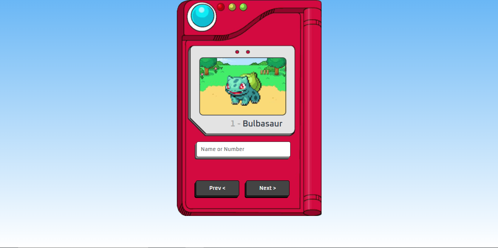

# Pokedex
Uma simples pokedex em javascript

## O projeto

  

## Resumo
Este projeto tem como objetivo a criação de uma pokedex, para exibição de pokemons com base em seu `Nome` ou `ID`.

Futuramente serão adicionados:

| Recurso | Prioridade |
| ------ | ------ |
|  |  |

## Como rodar

### No Visual Studio Code ou via Browser
Realize o download do projeto e execute a pagina index.html

## Dependencias
Este projeto não possui dependências.

## Esta aplicação utiliza: 
JAVASCRIPT, HTML5, CSS3 e GIT